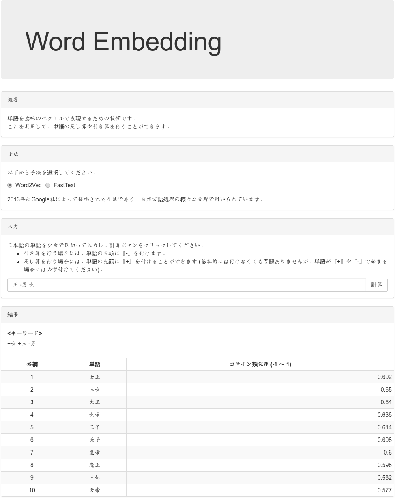

# 分散表現デモプログラム
[](LICENSE)
[](https://codeclimate.com/github/massongit/word_embedding-demo/maintainability)  
Word2VecやFastTextのモデルを用いて単語の加算・減算を行うデモプログラム

## 作者
Masaya Suzuki <suzukimasaya428@gmail.com>

## バージョン
0.0.2

## 開発言語・主要ライブラリ
### サーバーサイド
* [Python](https://www.python.org/) 3.x
* [Flask](http://flask.pocoo.org/)
* [gensim](https://radimrehurek.com/gensim/)
* [pyfasttext](https://github.com/vrasneur/pyfasttext)
* [natto-py](https://github.com/buruzaemon/natto-py)
* [uWSGI](https://uwsgi-docs.readthedocs.io/en/latest/)

### フロントエンド
* [Node.js](https://nodejs.org/ja/) 8.x
* [node-fetch](https://github.com/bitinn/node-fetch)
* [React](https://reactjs.org/)
* [Redux](https://redux.js.org/)
* [react-redux](https://redux.js.org/basics/usage-with-react)
* [Bootstrap](https://getbootstrap.com/)

## 対応ブラウザ
[browserl.ist: A page to display compatible browsers from a browserslist string.](http://browserl.ist/?q=>+0.5%25%2C+>+0.5%25+in+JP%2C+last+2+versions%2C+Firefox+ESR%2C+not+dead)参照

## 必要なソフトウェア
### 共通
* [MeCab](http://taku910.github.io/mecab/) (Word2Vecのモデルを使用する場合のみ)
* [Python](https://www.python.org/) 3.x
* [pipenv](https://docs.pipenv.org/) (インストールコマンド: `pip install pipenv`)
* [nginx](http://nginx.org/) (uWSGI + nginxを使う場合のみ)

### `front/build`ディレクトリがない場合のみ
* [Node.js](https://nodejs.org/ja/) 8.x
* [Yarn](https://yarnpkg.com/ja/)

## 必要なデータ
* 分散表現 (Word2VecやFastText) のモデル
* 分散表現のモデルを生成する際に使用した[MeCab](http://taku910.github.io/mecab/)用の辞書 (Word2Vecのモデルを使用する場合のみ)

## 環境構築方法
### uWSGI + nginxを使う場合のみ
1. 以下のように`/etc/systemd/system/word_embedding-demo.service`を作成します。  
※`TODO`部の指示通りに書き換えを行ってください。

    ```/etc/systemd/system/word_embedding-demo.service
    [Unit]
    Description=uWSGI instance to serve word_embedding-demo
    After=network.target
    
    [Service]
    # TODO: 以下を記述し、コメントアウトを解除
    # User={実行時のユーザー}
    # Group={実行時のグループ}
    # WorkingDirectory={このディレクトリのパス}/server/src
    ExecStart=/usr/local/bin/pipenv run uwsgi --ini ../configs/uwsgi.ini
    
    [Install]
    WantedBy=multi-user.target
    
    ```

1. 以下のように`/etc/nginx/sites-available/{ドメイン名}`を作成します。  
※`TODO`部の指示通りに書き換えを行ってください。

    ```/etc/nginx/sites-available/{ドメイン名}
    server {
        # TODO: 以下を記述し、コメントアウトを解除
        # server_name {ドメイン名};
        listen 80;
        
        # TODO: 以下を記述し、コメントアウトを解除
        # location ~ /{サブドメイン名}(/.*)?$ {
            include uwsgi_params;
            uwsgi_pass unix:///tmp/word_embedding-demo.sock;
            # TODO: 以下を記述し、コメントアウトを解除
            # uwsgi_param SCRIPT_NAME /{サブドメイン名};
            uwsgi_param PATH_INFO $1;
        }
    }
    
    ```

1. `sudo ln -s /etc/nginx/sites-available/{ドメイン名} /etc/nginx/sites-enabled/{ドメイン名}`コマンドを実行し、シンボリックリンクを作成します。

### `front/build`ディレクトリがない場合のみ
1. 端末を起動します。
1. `cd {このディレクトリ}/front`コマンドを実行します。
1. `yarn install`コマンドを実行します。
1. `yarn build`コマンドを実行します。
1. `cd ..`コマンドを実行します。

### 共通
1. 端末を起動します。
1. `nano {このディレクトリ}/server/condigs/general.ini`コマンドを実行し、`[word embedding]`と`[mecab]` (後者はWord2Vecのモデルを使用する場合のみ) の各項目を指定します。
1. `cd {このディレクトリ}/server/src`コマンドを実行します。
1. `pipenv install`コマンドを実行します。

## 実行方法
### Pythonを直接起動する場合
1. 端末を起動します。
1. `cd {このディレクトリ}/server/src`コマンドを実行します。
1. `pipenv shell`コマンドを実行します。
1. `python server.py`コマンドを実行します。
1. ブラウザから[http://localhost:5000/](http://localhost:5000/)にアクセスします。

### uWSGI + nginxを使う場合
1. `sudo systemctl start nginx word_embedding-demo`コマンドを実行します。
1. ブラウザからアクセスします。

## スクリーンショット


## ディレクトリ構造
* front/: フロントエンドのプログラムが格納されている
    * build/: ビルドした内容物が格納されている
    * public/: 静的なファイルが格納されている
        * index.html: フロントエンドのHTML
    * src/: ソースが格納されている
        * \_\_tests\_\_/: テストが格納されている
            * actions/: [Redux](https://redux.js.org/)のActionCreatorのテストが格納されている
                * index.js: ActionCreatorのテスト
            * components/: [React](https://reactjs.org/)のComponentのテストが格納されている
                * \_\_snapshots\_\_/: スナップショットテストで用いるデータが格納されている
                * Header.js: ヘッダーのテスト
                * OutputPanel.js: 計算結果表示部のパネルのContainerのテスト
            * containers/: [react-redux](https://redux.js.org/basics/usage-with-react)のContainerのテストが格納されている
                * \_\_snapshots\_\_/: スナップショットテストで用いるデータが格納されている
                * App.js: ルート要素のContainerのテスト
                * Information.js: 計算結果表示部のContainerのテスト
                * Input.js: 入力部のContainerのテスト
                * KeyWords.js: 入力文をボタンのグループとして表示するComponentのContainerのテスト
                * PanelBody.js: PanelのBodyのContainerのテスト
            * reducers/: [Redux](https://redux.js.org/)のReducerのテストが格納されている
                * index.js: ルートReducerのテスト
                * loading.js: ローディングActionのテスト
                * showSimilarWords.js: 分散表現による計算結果の表示ActionのReducerのテスト
        * actions/: [Redux](https://redux.js.org/)のActionCreatorが格納されている
            * index.js: ActionCreator
            * type.js: Actionのタイプ
        * components/: [React](https://reactjs.org/)のComponentが格納されている
            * App.js: ルート要素
            * DescriptionPanel.js: 概要パネル
            * Header.js: ヘッダー
            * Information.js: 計算結果表示部
            * Input.js: 入力部
            * InputPanel.js: 入力部のパネル
            * Input.js: 手法選択部
            * InputPanel.js: 手法選択部のパネル
            * KeyWords.js: 入力文をボタンのグループとして表示するComponent
            * OutputPanel.js: 計算結果表示部のパネル
            * PanelBody.js: PanelのBody
        * containers/: [react-redux](https://redux.js.org/basics/usage-with-react)のContainerが格納されている
            * App.js: ルート要素のContainer
            * Information.js: 計算結果表示部のContainer
            * Input.js: 入力部のContainer
            * KeyWords.js: 入力文をボタンのグループとして表示するComponentのContainer
            * Input.js: 手法選択部のContainer
            * PanelBody.js: PanelのBodyのContainer
        * reducers/: [Redux](https://redux.js.org/)のReducerが格納されている
            * index.js: ルートReducer
            * loading.js: ローディングActionのReducer
            * setMethod.js: 手法セットActionのReducer
            * setMethods.js: 手法一覧セットActionのReducer
            * showSimilarWords.js: 分散表現による計算結果の表示ActionのReducer
        * configs/: 設定が格納されている
            * general.json: 一般設定
        * test_data/: テストで使用するデータが格納されている
        * translations/: メッセージリソースが格納されている
            * en.json: 英語のメッセージリソース
            * ja.json: 日本語のメッセージリソース
        * index.js: ルートとなるスクリプト
        * intl.js: メッセージリソース関連のスクリプト
        * setupTests.js: テストの際のセットアップ用スクリプト
    * .gitignore: Gitの管理から除外するファイル一覧
    * package.json: [Node.js](https://nodejs.org/ja/)の設定
    * yarn.lock: [Node.js](https://nodejs.org/ja/)のパッケージ情報 ([Yarn](https://yarnpkg.com/ja/)が使用)
* server/: サーバーサイドのプログラムが格納されている
    * configs/: 設定が格納されている
        * general.ini: 一般設定
        * uwsgi.ini: uWSGIを使用する場合の設定
    * logs: ログが格納されている
    * src/: ソースが格納されている
        * config.py: 設定ファイルを扱うためのオブジェクト
        * Pipfile: Pythonのパッケージ情報 ([pipenv](https://docs.pipenv.org/)が使用)
        * Pipfile.lock: Pythonのパッケージ情報 ([pipenv](https://docs.pipenv.org/)が使用)
        * server.py: サーバー
        * test_server.py: テスト用スクリプト
    * tests/: テストで用いるJSONファイルが格納されている
    * .gitignore: Gitの管理から除外するファイル一覧
* .gitignore: Gitの管理から除外するファイル一覧
* LICENSE: ライセンス
* README.md: README (MarkDown形式)
* README_develop.md: 開発者向けREADME (MarkDown形式)
* screenshot.png: スクリーンショット
